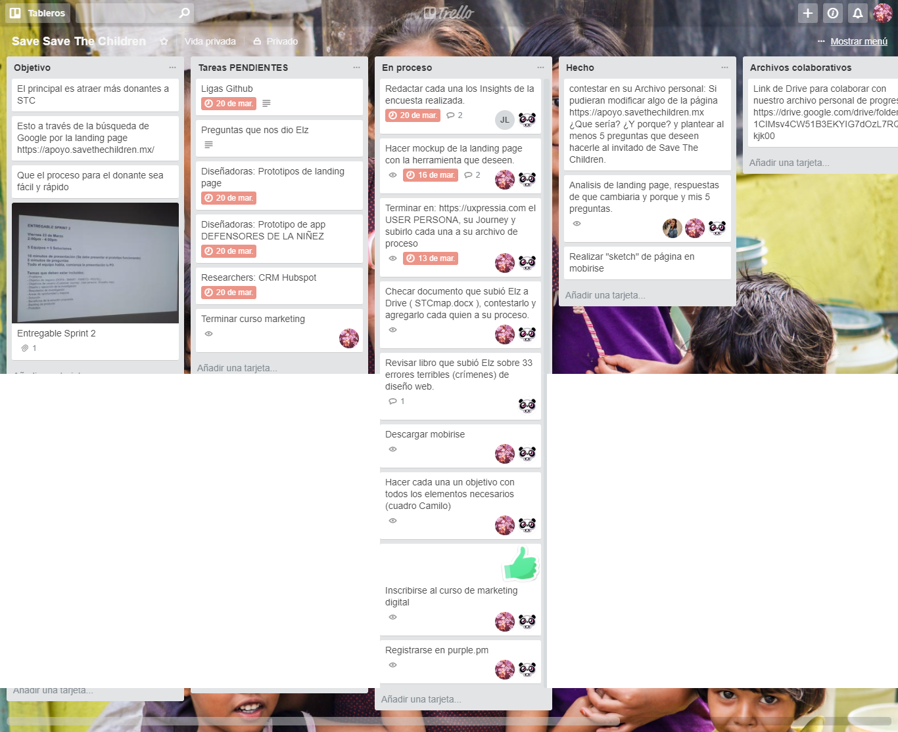

# Save Save The Children

Save the Childen es una institución no gubernamental con 100 años de experiencia a nivel mundial y 45 en México, ellos buscan mayor adquisición de donantes a través de Google

# EQUIPO

* **Product Owner:** Elzbeth Blanco
* **UX Designers:** Adriana Dillarza y Carmen Vega
* **UX Researchers:** Tania Sosa, Jazmín Solis y Karina Quezada

# RETO

Save the Children cuenta con un grant de Google Adwords con el cual se
dirigimos tráfico a una página de que tiene como finalidad generar donantes
recurrentes (https://apoyo.savethechildren.mx/defensores-de-la-ninez-t2)

# PROCESO

Para poder ayudar a Save the Children debemos seguir el proceso de enetendiemiento de como es que opera y como recibe donaciones en este momento.

# ORGANIZACION DEL EQUIPO

Esta se llevo a cabo a través de Trello en el siguiente tablero:

# MODELO CANVAS STC

# ANALISIS FODA

# OBJETIVOS SMART

**Estrategia:** 
* Reforzar la credibilidad de STC aumentando el número de visitantes convertidos a donantes.

**Objetivos SMART:**
* Atraer la atención de futuros donantes y de donantes activos.
* Crear empatía con los usuarios

**Problema** 

* No se muestra información o imagenes que llame la atención del público.
* No se genera suficiente confianza en el donador

**Causas**
* El contenido debe ser empático
* El que se usa hasta el momento es muy triste
* Falta de personal para controlar el contenido

# ESTABLECER OBJETIVO DEL NEGOCIO

# USER PERSONA

Se debe establecer quien es el user persona para poder entender como reaccionaría y con esto crear el journey de donación

# CUSTOMER JOURNEY MAP

En base al user persona definido anteriormente se define su jouney map

# TESTEO DE JOURNEY ACTUAL

Para poder ver las reacciones del usuario con el journey de donación actual se creo un prototipo interactivo con la herramienta Invision;con el que se podra seguir el como es donar y conocer las reacciones de los usuarios. El Journey que seguirán es el siguiente:

https://invis.io/26GCC2Y8VTR

# ENCUESTA

Con el prototipo anterior se creó una encuesta la cual arrojo los siguientes resultados:

# INSIGHTS

En base a los resultados obtenidos en la encuesta se pudieron obtene vaiosinsights los cuales se muestran a continuación:

# BACKLOG

Con los datos de toda la investigación secomenzó a crear el backlog de producto y se procedio aproponer soluciones

# PROPUESTA LANDING PAGE

Con la información recopilada se comenzo a bosquejar un prototipo ára la solución, cadaintegrante de equipo ropuso una opción al área de diseño.

# SOLUCION

Alfinal se hizo una combinación de aspectos de las propuestas y el resultado final se muestra a continuación:
Landing Page

Formulario Donación

Agradecimiento de donación

Se puede ver en funcionamiento en el siguiente enlace:

https://karyrq.github.io/prueba-1/.

A la par que se hacía la propuesta para la landing page también se buscó mejorar la aplicación óvil de Save the Children México ña propuesta se muestra a continuación:

# CONCLUSIONES

Con esta propuesta de la landing page se espera que losposibles donantes se interesen más por la acción de donar ya que se intentó empatizar con los usuarios al hacer más amena y menos pesada lpágina al enfatizar los puntos más importantes y reduciendo la cantidadde información que semaneja en la actualidad.

# INFORMACIÓN

A través del proceso se trabajo con varias herramientas y formatos los cuales se muestran en el siguiente documento:

https://drive.google.com/file/d/1-yAsMwp-bdald_0NFR_cRw54myEJpPXG/view?usp=sharing

