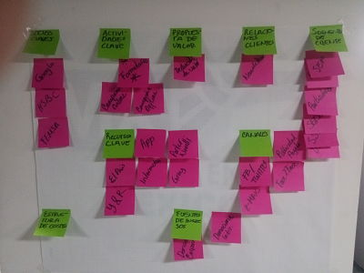

# Save Save The Children

Save the Childen es una institución no gubernamental con 100 años de experiencia a nivel mundial y 45 en México, ellos buscan maypr adquisic+on de donantes a través de Google

# EQUIPO

* **Product Owner:** Elzbeth Blanco
* **UX Designers:** Adriana Dillarza y Carmen Vega
* **UX Researchers:** Tania Sosa, Jazmín Solis y Karina Quezada

# RETO

Save the Children cuenta con un grant de Google Adwords con el cual se
dirigimos tráfico a una página de que tiene como finalidad generar donantes
recurrentes (https://apoyo.savethechildren.mx/defensores-de-la-ninez-t2)

# PROCESO

Para poder ayudar a Save the Children debemos seguir el proceso de enetendiemiento de como es que opera y como recibe donaciones en este momento.

# MODELO CANVAS STC

# ANALISIS FODA

# OBJETIVOS SMART

**Estrategia:** 
* Reforzar la credibilidad de STC aumentando el número de visitantes convertidos a donantes.

**Objetivos SMART:**
* Atraer la atención de futuros donantes y de donantes activos.
* Crear empatía con los usuarios

**Problema** 

* No se muestra información o imagenes que llame la atención del público.
* No se genera suficiente confianza en el donador

**Causas**
* El contenido debe ser empático
* El que se usa hasta el momento es muy triste
* Falta de personal para controlar el contenido

# ESTABLECER OBJETIVO DEL NEGOCIO

# USER PERSONA

Se debe establecer quien es el user persona para poder entender como reaccionaría y con esto crear el journey de donación

# CUSTOMER JOURNEY MAP

En base al user persona definido anteriormente se define su jouney map

# TESTEO DE JOUENEY ACTUAL

Para poder ver las reacciones del usuario con el journey de donación actual se creo un prototipo interactivo con la herramienta Invision;con el que se podra seguir el como es donar y conocer las reacciones de los usuarios. El Journey que seguirán es el siguiente:

# ENCUESTA

Con el protoripo anterior se creó una encuesta la cual arrojo los siguientes resultados:
